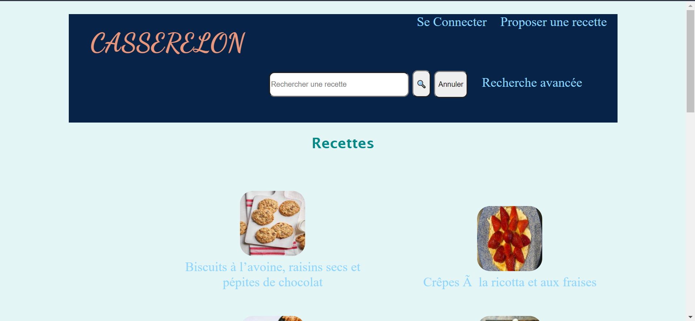
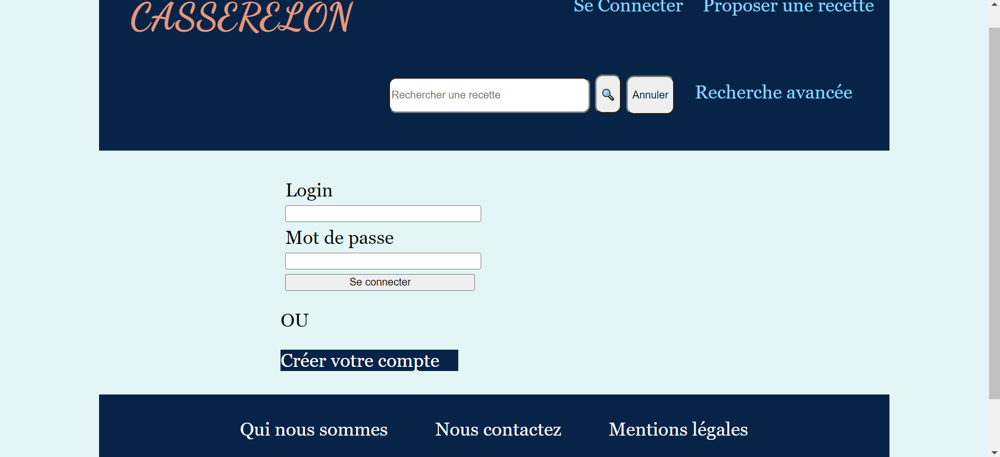

# site des recettes de cuisine

Dans le cadre d'apprentissage de réalisation des sites web, j'ai participé avec deux autres camarades de classes à la réalisation de ce projet d'un site web dynamique dont le but était de renseigner à toute internaute se trouvant sur le site les différentes étapes de préparation d'une recette de cuisine, le temps de préparation de la recette, les ingrédients nécessaires pour préparer la recette ainsi que le coût de la recette. 

En terme de techonologies utilisés, il y a:

<ul>
  <li><b>le HTML</b>: pour structurer le contenu du site.</li>
  <li><b>le CSS</b>: pour mettre en forme le contenu ainsi que donner un aspect d'adaptation de la forme du contenu en fonction des écrans(PC, tablette et téléphone).</li>
  <li><b>le PHP</b>: pour permettre une liaison entre la base de données et le site web, permettre à un utilisateur de s'authentifier s'il un compte sinon en créer, permettre aux utilisateurs de rechercher une recette dans la barre de recherche qu'ils soient connectés ou pas, permettre aux utilisateurs ayant des comptes d'ajouter des recettes, d'apporter des modifications à une(des) recette(s) se trouvant sur le site, commenter une recette ainsi que ajouter une recette aux favoris.</li>
  <li><b>le SQL</b>: pour créer la base données, y ajouter les tables ou relations ainsi que lancer des requêtes de modification de la base pour mettre à jour la base de données.</li>
</ul>

<h1>Captures d'écrans du site</h1>

 Comme le site web est hébergé sur un serveur de l'université et que la base de données est elle aussi sur un SGBD MariaDB de l'université, je vous mets les captures d'écrans du site au lieu de vous mettre l'URL de ce dernier afin d'éviter que vous soyez redirigé sur un lien qui risque d'être inactif car les serveurs sont archivés chaque année.

